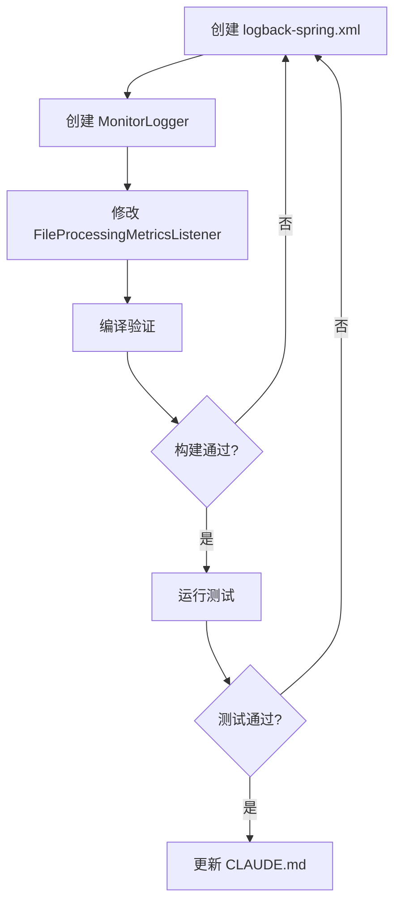

# 日志配置实现计划

## 1. 概述

为 spring-batch-demo 项目添加 Logback 文件日志输出，按类型分文件、按 profile 分控制台级别。

**目标：**
- 日志输出到文件（控制台保留）
- 四类日志分文件存储：应用日志、错误日志、监控日志、SQL 日志
- 差异化的滚动策略和保留周期
- Profile 敏感的日志级别（dev DEBUG / 非 dev WARN）

---

## 2. 设计决策总表

| 决策项 | 选择 |
|---|---|
| 部署环境 | Linux 服务器，日志路径 `./logs/`（相对路径） |
| 日志文件分类 | app.log / error.log / monitor.log / sql.log + 控制台 |
| 滚动策略 | 差异化：app 按天/30天，error 按天/60天，monitor 按天/30天，sql 按大小50M/3个 |
| 监控日志格式 | JSON 结构化（MonitorLogger + Jackson 序列化） |
| 监控字段 | fileType, filePath, duration, readCount, writeCount, filterCount, skipCount, jobName, stepName, stepExecutionId, exitStatus, commitCount, rollbackCount, processSkipCount, startTime, endTime |
| SQL 日志粒度 | SQL 文本 + 参数绑定值（org.hibernate.SQL=DEBUG, org.hibernate.orm.jdbc.bind=TRACE） |
| 控制台级别 | dev: DEBUG+ / 非 dev: WARN+（springProfile 区分） |
| 配置方式 | 单文件 `logback-spring.xml` + `<springProfile>` |
| 监控组件 | MonitorLogger（@Component，命名 Logger，Jackson 序列化） |
| Logger 级别 | 应用包 DEBUG, Batch INFO, Spring WARN, Hibernate WARN, Liquibase INFO |

---

## 3. 日志文件目录结构

```
logs/
├── app/
│   ├── app.log                         # 当前日志
│   └── app.%d{yyyy-MM-dd}.log          # 按天归档，保留 30 天
├── error/
│   ├── error.log                       # 当前日志（仅 ERROR 级别）
│   └── error.%d{yyyy-MM-dd}.log        # 按天归档，保留 60 天
├── monitor/
│   ├── monitor.log                     # 当前日志（JSON 格式）
│   └── monitor.%d{yyyy-MM-dd}.log      # 按天归档，保留 30 天
└── sql/
    ├── sql.log                         # 当前日志
    ├── sql.1.log                       # 归档（50MB 触发）
    ├── sql.2.log                       # 归档
    └── sql.3.log                       # 归档（最旧，被覆盖）
```

---

## 4. 修改文件清单

### 4.1 新增文件

| 文件 | 说明 |
|---|---|
| `src/main/resources/logback-spring.xml` | Logback 全量配置：4 个 FileAppender + ConsoleAppender |
| `src/main/java/cn/reid/springbatchdemo/monitor/MonitorLogger.java` | 监控日志组件，输出 JSON 结构化监控指标 |

### 4.2 修改文件

| 文件 | 修改内容 |
|---|---|
| `src/main/java/cn/reid/springbatchdemo/listener/FileProcessingMetricsListener.java` | 注入 MonitorLogger，将步骤完成指标输出到 monitor.log |

### 4.3 不变文件

StudentProcessor、StudentFieldSetMapper — 保留现存 SLF4J Logger 不变（仅切换日志路由，不改代码）。

---

## 5. logback-spring.xml 详细设计

### 5.1 全局变量

| 变量 | 值 |
|---|---|
| `LOG_PATH` | `./logs` |
| `FILE_LOG_PATTERN` | `%d{yyyy-MM-dd HH:mm:ss.SSS} [%thread] %-5level %logger{36} - %msg%n` |
| `CONSOLE_LOG_PATTERN` | `%d{yyyy-MM-dd HH:mm:ss.SSS} [%thread] %-5level %logger{36} - %msg%n` |

### 5.2 Console 级别控制（springProfile）

```xml
<springProfile name="dev">
    <property name="CONSOLE_LEVEL" value="DEBUG"/>
</springProfile>
<springProfile name="!dev">
    <property name="CONSOLE_LEVEL" value="WARN"/>
</springProfile>
```

ConsoleAppender 使用 `ThresholdFilter` + `${CONSOLE_LEVEL}` 变量。

### 5.3 Appender 定义

**a) CONSOLE** — 控制台输出
- 编码器：标准格式
- 过滤器：`ThresholdFilter`，阈值由 `${CONSOLE_LEVEL}` 控制

**b) APP_FILE** — 应用日志文件
- RollingPolicy：`TimeBasedRollingPolicy`，按天
- maxHistory：30
- 编码器：标准格式

**c) ERROR_FILE** — 错误日志文件
- RollingPolicy：`TimeBasedRollingPolicy`，按天
- maxHistory：60
- 过滤器：`ThresholdFilter`，level=ERROR
- 编码器：标准格式

**d) MONITOR_FILE** — 监控日志文件
- RollingPolicy：`TimeBasedRollingPolicy`，按天
- maxHistory：30
- 编码器：`%msg%n`（仅消息，因为 MonitorLogger 已输出完整 JSON 行）

**e) SQL_FILE** — SQL 日志文件
- RollingPolicy：`FixedWindowRollingPolicy`（minIndex=1, maxIndex=3）
- TriggeringPolicy：`SizeBasedTriggeringPolicy`（maxFileSize=50MB）
- 编码器：精简时间格式 `%d{HH:mm:ss.SSS} [%thread] %-5level %logger{36} - %msg%n`

### 5.4 Logger 配置

```xml
<!-- 监控日志路由 → monitor.log -->
<logger name="MonitorLogger" level="INFO" additivity="false">
    <appender-ref ref="MONITOR_FILE"/>
</logger>

<!-- Hibernate SQL → sql.log（不向上传播） -->
<logger name="org.hibernate.SQL" level="DEBUG" additivity="false">
    <appender-ref ref="SQL_FILE"/>
</logger>
<logger name="org.hibernate.orm.jdbc.bind" level="TRACE" additivity="false">
    <appender-ref ref="SQL_FILE"/>
</logger>

<!-- 应用包级别控制 -->
<logger name="cn.reid.springbatchdemo" level="DEBUG"/>
<logger name="org.springframework.batch" level="INFO"/>
<logger name="org.springframework" level="WARN"/>
<logger name="org.hibernate" level="WARN"/>
<logger name="liquibase" level="INFO"/>

<!-- Root -->
<root level="INFO">
    <appender-ref ref="CONSOLE"/>
    <appender-ref ref="APP_FILE"/>
    <appender-ref ref="ERROR_FILE"/>
</root>
```

### 5.5 Profile 行为总结

| Profile | 控制台级别 | 文件输出 |
|---|---|---|
| dev（激活） | DEBUG+ | app.log / error.log / monitor.log / sql.log |
| 无 profile / 其他 | WARN+ | app.log / error.log / monitor.log / sql.log |

---

## 6. MonitorLogger 组件设计

### 6.1 类信息

- **包路径**: `cn.reid.springbatchdemo.monitor.MonitorLogger`
- **注解**: `@Component`
- **内部 Logger**: `LoggerFactory.getLogger("MonitorLogger")`（名称匹配 Logback 配置中的 `<logger name="MonitorLogger">`）
- **依赖**: `ObjectMapper`（Jackson，Spring Boot Web 已自带）

### 6.2 API 设计

```java
void logMetrics(StepExecution stepExecution, long startTime, long duration,
                 String fileType, String filePath)
```

### 6.3 输出 JSON 结构

```json
{
  "timestamp": "2026-05-24T10:30:00.000",
  "eventType": "STEP_COMPLETION",
  "jobName": "fileJob",
  "stepName": "fileStep",
  "stepExecutionId": 42,
  "exitStatus": "COMPLETED",
  "fileType": "STUDENT",
  "filePath": "/data/student.csv",
  "durationMs": 12345,
  "durationSeconds": 12,
  "readCount": 1000,
  "writeCount": 980,
  "filterCount": 15,
  "skipCount": 5,
  "processSkipCount": 5,
  "commitCount": 10,
  "rollbackCount": 0,
  "startTime": "2026-05-24T10:29:48",
  "endTime": "2026-05-24T10:30:00"
}
```

---

## 7. FileProcessingMetricsListener 修改计划

当前代码中 `beforeStep()` 和 `afterStep()` 均使用 `log.info()` 输出指标。

修改后：
- `beforeStep()` — 保留 `log.info()` → 输出到 app.log（启动事件不进入 monitor.log）
- `afterStep()` — 注入 `MonitorLogger`，调用 `monitorLogger.logMetrics(...)` → 输出 JSON 到 monitor.log
- 移除 `afterStep()` 中的 `log.info()` 调用（避免重复）

---

## 8. 未涉及的文件说明

| 文件 | 原因 |
|---|---|
| `application.properties` | 不修改。所有日志级别已在 logback-spring.xml 中配置，无需 Spring properties 重复设置 |
| `test/resources/application.properties` | 不修改。测试不关心文件输出，使用默认 logback-spring.xml（无 profile 时为非 dev 行为：控制台 WARN+，文件会写入但不影响测试结果） |
| StudentProcessor / StudentFieldSetMapper | 不修改。现有 `log.warn()` 属于应用业务日志，继续输出到 app.log，无需改动 |

---

## 9. 实施步骤



### 步骤 1：创建 logback-spring.xml
- 定义 LOG_PATH 和日志格式变量
- 通过 springProfile 设置 CONSOLE_LEVEL
- 定义 5 个 Appender（CONSOLE / APP_FILE / ERROR_FILE / MONITOR_FILE / SQL_FILE）
- 配置 5 个 Logger + Root

### 步骤 2：创建 MonitorLogger
- @Component
- 命名 Logger "MonitorLogger"
- Jackson ObjectMapper 序列化监控指标 Map → JSON
- `logMetrics()` 方法

### 步骤 3：修改 FileProcessingMetricsListener
- 注入 MonitorLogger
- afterStep 中调用 monitorLogger.logMetrics()

### 步骤 4：编译 + 测试验证
- `./mvnw clean compile`
- `./mvnw test`

### 步骤 5：更新 CLAUDE.md
- 追加日志配置相关约定

---

## 10. 验证清单

| 验证项 | 验证方法 |
|---|---|
| 编译通过 | `mvnw clean compile` 无报错 |
| 单测通过 | `mvnw test` 全部绿色 |
| app.log 输出 | 启动应用后，`./logs/app/app.log` 存在且有 INFO 级别日志 |
| error.log 输出 | 触发 ERROR 场景后，`./logs/error/error.log` 包含对应记录 |
| monitor.log 输出 | Batch Job 执行后，`./logs/monitor/monitor.log` 包含 JSON 格式指标行 |
| sql.log 输出 | Batch Job 执行后，`./logs/sql/sql.log` 包含 SQL 语句和参数绑定值 |
| 控制台级别（dev） | `--spring.profiles.active=dev` 启动，控制台可见 DEBUG 日志 |
| 控制台级别（非 dev） | 默认启动，控制台只显示 WARN+ |

---