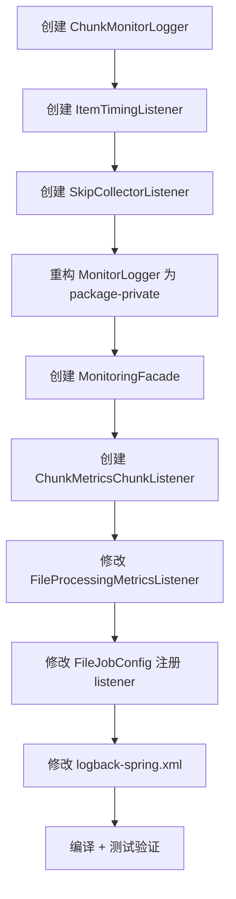

# Job 监控实现计划

## 1. 概述

为 `fileJob` 增加 Chunk 级性能画像 + 跳过原因分析，便于定位性能瓶颈和优化数据质量。

**目标：**
- Chunk 级耗时拆分（读/处理/写三阶段），独立输出到 `chunk-monitor.log`
- Step 结束时聚合跳过原因，输出汇总到 `monitor.log`
- 通过 MonitoringFacade 门面统一对外入口

---

## 2. 设计决策总表

| 决策项 | 选择 |
|---|---|
| 监控粒度 | Chunk 级性能画像（B）+ 跳过模式分析（C） |
| Chunk 指标输出方式 | 独立文件 `chunk-monitor.log` |
| 三阶段耗时 | 拆开 reader/processor/writer 分别计时 |
| ItemListener | 只计时不写日志，ChunkListener 统一输出 |
| 跳过信息级别 | 异常类型 + message（不记录字段值） |
| Skip 输出时机 | Step 结束时汇总输出（不实时输出） |
| Skip 输出目标 | `monitor.log`，eventType=SKIP_SUMMARY |
| 门面模式 | MonitoringFacade 为唯一对外入口 |
| MonitorLogger | 改为 package-private，由 Facade 委派 |
| ChunkMonitorLogger | 独立 package-private 组件 |

---

## 3. 组件架构

```
                    MonitoringFacade (@Component)
                           │
               ┌───────────┼───────────────┐
               ▼           ▼               ▼
        MonitorLogger  ChunkMonitorLogger  SkipCollectorListener
        (pkg-private)   (pkg-private)       (pkg-private)
               ▼           ▼
         monitor.log  chunk-monitor.log

  ItemTimingListener (pkg-private)
  → 被 ChunkListener 在 beforeChunk/afterChunk 中查询累计耗时
  → 本身不写日志
```

### 组件职责

| 组件 | 职责 |
|---|---|
| `MonitoringFacade` | 唯一对外 @Component，暴露 logStepMetrics()、logChunkMetrics()、logSkipSummary() 方法 |
| `MonitorLogger` | 现有，改为 package-private，由 Facade 调用，输出到 monitor.log |
| `ChunkMonitorLogger` | 新增 package-private，输出 chunk 指标到 chunk-monitor.log |
| `ItemTimingListener` | 新增 package-private，实现 ItemReadListener/ItemProcessListener/ItemWriteListener，三个 NanoTimer 累加各阶段耗时 |
| `SkipCollectorListener` | 新增 package-private，实现 SkipListener，收集跳过异常，afterStep 时输出汇总 |

---

## 4. 文件修改清单

### 4.1 新增文件

| 文件 | 说明 |
|---|---|
| `monitor/ChunkMonitorLogger.java` | Chunk 级指标 JSON 输出，命名 Logger "ChunkMonitorLogger" |
| `monitor/ItemTimingListener.java` | 三阶段计时器（ItemReadListener + ItemProcessListener + ItemWriteListener），内部维护三个累加器 |
| `monitor/SkipCollectorListener.java` | SkipListener，收集 onSkipInProcess/onSkipInWrite 的异常信息，afterStep 返回聚合 Map |
| `monitor/MonitoringFacade.java` | @Component，统一对外入口 |
| `monitor/StepExecutionState.java` | 辅助类，封装一个 Step 执行期间的共享状态（chunkIndex、skipReasons 等） |

### 4.2 修改文件

| 文件 | 修改内容 |
|---|---|
| `MonitorLogger.java` | 去掉 @Component，改为 package-private class；构造函数直接实例化 Logger（不由 Spring 管理） |
| `FileProcessingMetricsListener.java` | 注入 MonitoringFacade 替代 MonitorLogger |
| `FileJobConfig.java` | 注册 ItemTimingListener（作为 ItemRead/Process/Write 三个 listener）、SkipCollectorListener、ChunkMetricsListener |
| `logback-spring.xml` | 新增 CHUNK_MONITOR_FILE appender + `<logger name="ChunkMonitorLogger">` 路由 |
| `CLAUDE.md` | 追加 MonitoringFacade、Chunk 监控、Skip 汇总的约定 |

### 4.3 不变文件

StudentProcessor、StudentFieldSetMapper、application.properties、所有测试文件、MonitorLogger 的 logMetrics() 方法签名不变（调用方变为 Facade）。

---

## 5. logback-spring.xml 修改

在现有配置中新增：

```xml
<!-- Chunk monitor file appender -->
<appender name="CHUNK_MONITOR_FILE" class="ch.qos.logback.core.rolling.RollingFileAppender">
    <file>${LOG_PATH}/chunk-monitor/chunk-monitor.log</file>
    <rollingPolicy class="ch.qos.logback.core.rolling.TimeBasedRollingPolicy">
        <fileNamePattern>${LOG_PATH}/chunk-monitor/chunk-monitor.%d{yyyy-MM-dd}.log</fileNamePattern>
        <maxHistory>7</maxHistory>
    </rollingPolicy>
    <encoder>
        <pattern>%msg%n</pattern>
    </encoder>
</appender>

<!-- ChunkMonitorLogger - routed to CHUNK_MONITOR_FILE only -->
<logger name="ChunkMonitorLogger" level="INFO" additivity="false">
    <appender-ref ref="CHUNK_MONITOR_FILE"/>
</logger>
```

---

## 6. ChunkMonitorLogger 设计

```java
package cn.reid.springbatchdemo.monitor;

import com.fasterxml.jackson.core.JsonProcessingException;
import com.fasterxml.jackson.databind.ObjectMapper;
import org.slf4j.Logger;
import org.slf4j.LoggerFactory;

import java.time.LocalDateTime;
import java.time.format.DateTimeFormatter;
import java.util.LinkedHashMap;
import java.util.Map;

class ChunkMonitorLogger {

    private static final Logger log = LoggerFactory.getLogger("ChunkMonitorLogger");

    private final ObjectMapper objectMapper;

    ChunkMonitorLogger(ObjectMapper objectMapper) {
        this.objectMapper = objectMapper;
    }

    void logChunk(String jobName, String stepName, int chunkIndex,
                  int itemCount, long readDurationNs, long processDurationNs,
                  long writeDurationNs, long readCount, long writeCount,
                  long filterCount, LocalDateTime startTime, LocalDateTime endTime) {
        try {
            Map<String, Object> m = new LinkedHashMap<>();
            m.put("eventType", "CHUNK_COMPLETION");
            m.put("timestamp", endTime.format(DateTimeFormatter.ISO_LOCAL_DATE_TIME));
            m.put("jobName", jobName);
            m.put("stepName", stepName);
            m.put("chunkIndex", chunkIndex);
            m.put("itemCount", itemCount);
            m.put("readDurationMs", readDurationNs / 1_000_000);
            m.put("processDurationMs", processDurationNs / 1_000_000);
            m.put("writeDurationMs", writeDurationNs / 1_000_000);
            m.put("chunkTotalDurationMs", (readDurationNs + processDurationNs + writeDurationNs) / 1_000_000);
            m.put("readCount", readCount);
            m.put("writeCount", writeCount);
            m.put("filterCount", filterCount);
            m.put("startTime", startTime.format(DateTimeFormatter.ISO_LOCAL_DATE_TIME));
            m.put("endTime", endTime.format(DateTimeFormatter.ISO_LOCAL_DATE_TIME));
            log.info(objectMapper.writeValueAsString(m));
        } catch (JsonProcessingException e) {
            log.error("序列化 chunk 监控指标失败", e);
        }
    }
}
```

---

## 7. ItemTimingListener 设计

实现三个接口：ItemReadListener\<Student\> + ItemProcessListener\<Student, Student\> + ItemWriteListener\<Student\>

内部维护三个 `AtomicLong` 累加器，分别累计 reader/processor/writer 的总耗时（纳秒）。
只在 before/after 回调中计时和累加，不写日志。

```java
package cn.reid.springbatchdemo.monitor;

import cn.reid.springbatchdemo.entity.Student;
import org.springframework.batch.core.ItemReadListener;
import org.springframework.batch.core.ItemProcessListener;
import org.springframework.batch.core.ItemWriteListener;
import org.springframework.stereotype.Component;

import java.util.List;
import java.util.concurrent.atomic.AtomicLong;

@Component
class ItemTimingListener implements
        ItemReadListener<Student>,
        ItemProcessListener<Student, Student>,
        ItemWriteListener<Student> {

    private final ThreadLocal<Long> readStart = new ThreadLocal<>();
    private final ThreadLocal<Long> processStart = new ThreadLocal<>();
    private final ThreadLocal<Long> writeStart = new ThreadLocal<>();

    final AtomicLong readTotalNs = new AtomicLong();
    final AtomicLong processTotalNs = new AtomicLong();
    final AtomicLong writeTotalNs = new AtomicLong();

    // 每 chunk 开始时重置
    void reset() {
        readTotalNs.set(0);
        processTotalNs.set(0);
        writeTotalNs.set(0);
    }

    // ========== ItemReadListener ==========
    @Override
    public void beforeRead()       { readStart.set(System.nanoTime()); }
    @Override
    public void afterRead(Student item) { readTotalNs.addAndGet(took(readStart)); }
    @Override
    public void onReadError(Exception ex) { readStart.remove(); }

    // ========== ItemProcessListener ==========
    @Override
    public void beforeProcess(Student item) { processStart.set(System.nanoTime()); }
    @Override
    public void afterProcess(Student item, Student result) { processTotalNs.addAndGet(took(processStart)); }
    @Override
    public void onProcessError(Student item, Exception ex) { processStart.remove(); }

    // ========== ItemWriteListener ==========
    @Override
    public void beforeWrite(List<? extends Student> items) { writeStart.set(System.nanoTime()); }
    @Override
    public void afterWrite(List<? extends Student> items) { writeTotalNs.addAndGet(took(writeStart)); }
    @Override
    public void onWriteError(Exception ex, List<? extends Student> items) { writeStart.remove(); }

    private long took(ThreadLocal<Long> holder) {
        Long start = holder.get();
        holder.remove();
        return (start != null) ? System.nanoTime() - start : 0L;
    }
}
```

---

## 8. SkipCollectorListener 设计

实现 `SkipListener<Student, Student>`，收集跳过原因。在 StepExecutionListener.afterStep() 中返回汇总结果给 Facade。

```java
package cn.reid.springbatchdemo.monitor;

import cn.reid.springbatchdemo.entity.Student;
import org.springframework.batch.core.SkipListener;
import org.springframework.stereotype.Component;

import java.util.LinkedHashMap;
import java.util.Map;
import java.util.concurrent.ConcurrentHashMap;
import java.util.concurrent.atomic.AtomicInteger;

@Component
class SkipCollectorListener implements SkipListener<Student, Student> {

    private final ConcurrentHashMap<String, AtomicInteger> skipReasons = new ConcurrentHashMap<>();
    private volatile boolean enabled = false;

    void enable()                { this.enabled = true; }
    void disable()               { this.enabled = false; }
    void reset()                 { skipReasons.clear(); }

    Map<String, Integer> getSummary() {
        Map<String, Integer> result = new LinkedHashMap<>();
        skipReasons.forEach((reason, count) -> result.put(reason, count.get()));
        return result;
    }

    int getTotalSkips() {
        return skipReasons.values().stream().mapToInt(AtomicInteger::get).sum();
    }

    private void record(String reason) {
        if (enabled) {
            skipReasons.computeIfAbsent(reason, k -> new AtomicInteger()).incrementAndGet();
        }
    }

    @Override
    public void onSkipInRead(Throwable t) {
        record(formatReason(t));
    }

    @Override
    public void onSkipInProcess(Student item, Throwable t) {
        record(formatReason(t));
    }

    @Override
    public void onSkipInWrite(Student item, Throwable t) {
        record(formatReason(t));
    }

    private static String formatReason(Throwable t) {
        return t.getClass().getSimpleName() + ": " + t.getMessage();
    }
}
```

---

## 9. MonitoringFacade 设计

```java
package cn.reid.springbatchdemo.monitor;

import com.fasterxml.jackson.databind.ObjectMapper;
import org.springframework.stereotype.Component;

@Component
public class MonitoringFacade {

    private final MonitorLogger monitorLogger;
    private final ChunkMonitorLogger chunkMonitorLogger;

    MonitoringFacade(ObjectMapper objectMapper) {
        this.monitorLogger = new MonitorLogger(objectMapper);
        this.chunkMonitorLogger = new ChunkMonitorLogger(objectMapper);
    }

    // ========== Step 级 ==========
    public void logStepMetrics(StepExecution stepExecution, long startTime,
                                long duration, String fileType, String filePath) {
        monitorLogger.logMetrics(stepExecution, startTime, duration, fileType, filePath);
    }

    // ========== Skip 汇总 ==========
    public void logSkipSummary(String jobName, String stepName,
                                int totalSkips, Map<String, Integer> skipReasons) {
        monitorLogger.logSkipSummary(jobName, stepName, totalSkips, skipReasons);
    }

    // ========== Chunk 级 ==========
    public void logChunkMetrics(String jobName, String stepName, int chunkIndex,
                                 int itemCount, long readDurationNs, long processDurationNs,
                                 long writeDurationNs, long readCount, long writeCount,
                                 long filterCount, LocalDateTime startTime, LocalDateTime endTime) {
        chunkMonitorLogger.logChunk(jobName, stepName, chunkIndex, itemCount,
                readDurationNs, processDurationNs, writeDurationNs,
                readCount, writeCount, filterCount, startTime, endTime);
    }
}
```

MonitorLogger 需要新增 logSkipSummary() 方法：

```java
void logSkipSummary(String jobName, String stepName, int totalSkips,
                    Map<String, Integer> skipReasons) {
    try {
        Map<String, Object> m = new LinkedHashMap<>();
        m.put("eventType", "SKIP_SUMMARY");
        m.put("timestamp", LocalDateTime.now().format(DateTimeFormatter.ISO_LOCAL_DATE_TIME));
        m.put("jobName", jobName);
        m.put("stepName", stepName);
        m.put("totalSkips", totalSkips);
        m.put("skipReasons", skipReasons);
        log.info(objectMapper.writeValueAsString(m));
    } catch (JsonProcessingException e) {
        log.error("序列化 skip 汇总失败", e);
    }
}
```

---

## 10. FileJobConfig 修改

在 `fileStep` 注册新 listener：

```java
@Bean
public Step fileStep(
        JobRepository jobRepository,
        PlatformTransactionManager transactionManager,
        FlatFileItemReader<Student> studentReader,
        StudentProcessor studentProcessor,
        JdbcBatchItemWriter<Student> studentWriter,
        FileProcessingMetricsListener stepListener,
        ItemTimingListener timingListener,
        SkipCollectorListener skipListener) {

    return new StepBuilder("fileStep", jobRepository)
            .<Student, Student>chunk(100, transactionManager)
            .reader(studentReader)
            .processor(studentProcessor)
            .writer(studentWriter)
            .listener(stepListener)                          // StepExecutionListener
            .listener(timingListener)                        // ItemReadListener + ProcessListener + WriteListener
            .listener(skipListener)                          // SkipListener
            .listener(new ChunkMetricsChunkListener(
                    timingListener, skipListener,
                    stepListener))                           // ChunkListener (含 skip 汇总触发)
            .faultTolerant()
            .skip(FlatFileParseException.class)
            .skipLimit(Integer.MAX_VALUE)
            .build();
}
```

ChunkMetricsChunkListener 需要单独解释：它即是一个 ChunkListener，负责在 afterChunk 时从 ItemTimingListener 获取阶段耗时、从 FileProcessingMetricsListener 获取 startTime，组装后通过 MonitoringFacade 输出。

---

## 11. ChunkMetricsChunkListener 设计

```java
package cn.reid.springbatchdemo.monitor;

import cn.reid.springbatchdemo.listener.FileProcessingMetricsListener;
import org.springframework.batch.core.ChunkListener;
import org.springframework.batch.core.scope.context.ChunkContext;
import java.time.LocalDateTime;

class ChunkMetricsChunkListener implements ChunkListener {

    private final ItemTimingListener timingListener;
    private final SkipCollectorListener skipListener;
    private final FileProcessingMetricsListener stepListener;
    private final MonitoringFacade monitoringFacade;
    private int chunkIndex = 0;
    private LocalDateTime chunkStart;

    ChunkMetricsChunkListener(ItemTimingListener timingListener,
                               SkipCollectorListener skipListener,
                               FileProcessingMetricsListener stepListener,
                               MonitoringFacade monitoringFacade) {
        this.timingListener = timingListener;
        this.skipListener = skipListener;
        this.stepListener = stepListener;
        this.monitoringFacade = monitoringFacade;
    }

    @Override
    public void beforeChunk(ChunkContext context) {
        chunkStart = LocalDateTime.now();
        timingListener.reset();
        chunkIndex++;
    }

    @Override
    public void afterChunk(ChunkContext context) {
        LocalDateTime chunkEnd = LocalDateTime.now();
        var stepCtx = context.getStepContext().getStepExecution();
        String jobName = stepCtx.getJobExecution().getJobInstance().getJobName();
        String stepName = stepCtx.getStepName();
        int itemCount = stepCtx.getReadCount() - stepCtx.getRollbackCount();

        monitoringFacade.logChunkMetrics(
                jobName, stepName, chunkIndex,
                itemCount,
                timingListener.readTotalNs.get(),
                timingListener.processTotalNs.get(),
                timingListener.writeTotalNs.get(),
                stepCtx.getReadCount(),
                stepCtx.getWriteCount(),
                stepCtx.getReadCount() - stepCtx.getWriteCount() - stepCtx.getSkipCount(),
                chunkStart, chunkEnd
        );
    }

    @Override
    public void afterChunkError(ChunkContext context) {
        // 出错时不输出 chunk 指标
    }
}
```

---

## 12. FileProcessingMetricsListener 修改

注入 MonitoringFacade，替换 MonitorLogger 调用：

| 修改点 | 原代码 | 新代码 |
|---|---|---|
| 注入 | `MonitorLogger monitorLogger` | `MonitoringFacade monitoringFacade` |
| afterStep 调用 | `monitorLogger.logMetrics(...)` | `monitoringFacade.logStepMetrics(...)` |
| afterStep 新增 | （无） | 调用 `skipListener.getSummary()`，输出 Skip 汇总 |

---

## 13. 日志文件目录结构（新增）

```
logs/
├── chunk-monitor/
│   ├── chunk-monitor.log
│   └── chunk-monitor.%d{yyyy-MM-dd}.log   # 按天归档，保留 7 天
├── app/
├── error/
├── monitor/
└── sql/
```

---

## 14. 实施步骤



### 步骤 1-6：创建/重构 6 个 Java 类（如上设计）
### 步骤 7：修改 FileProcessingMetricsListener 改用 MonitoringFacade
### 步骤 8：修改 FileJobConfig 注册所有新 listener
### 步骤 9：修改 logback-spring.xml 新增 chunk-monitor appender
### 步骤 10：`./mvnw clean compile` + `./mvnw test` 验证

---

## 15. 验证清单

| 验证项 | 验证方法 |
|---|---|
| 编译通过 | `mvnw clean compile` 无报错 |
| 单测通过 | `mvnw test` 全部绿色 |
| chunk-monitor.log 输出 | 执行 job 后，`./logs/chunk-monitor/chunk-monitor.log` 包含 JSON 格式 chunk 指标 |
| 三阶段耗时可区分 | JSON 中 `readDurationMs` / `processDurationMs` / `writeDurationMs` 字段非零 |
| skip 汇总输出 | `./logs/monitor/monitor.log` 包含 `eventType=SKIP_SUMMARY` 的行 |
| 监听到测试数据的跳过 | 测试数据 6 行中有 3 行被过滤，filterCount=3 在各行指标中正确体现 |
| 无新引入的依赖 | pom.xml 无变动 |


